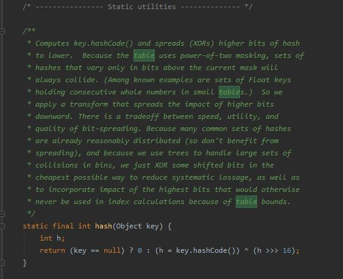

   
这是一个神奇的网站

   
 ***

 # 高并发
 
 ## 1.线程和进程

 ### 进程、线程的定义以及区别

  >进程是程序的一次执行过程，是系统运行程序的基本单位。

  >线程与进程相似，但线程是一个比进程更小的执行单位。

  一个进程在其执行的过程中可以产生多个线程。与进程不同的是同类的多个线程共享进程的**堆**和**方法区**资源，但每个线程有自己的**程序计数器**、**虚拟机栈**和**本地方法栈**，所以系统在产生一个线程，或是在各个线程之间作切换工作时，负担要比进程小得多，也正因为如此，线程也被称为**轻量级进程**。

 ### 线程的生命周期和状态
 Java 线程状态变迁如下图所示（图源《Java 并发编程艺术》4.1.4 节）：
 
线程的生命周期包含5个阶段，包括：新建、就绪、运行、阻塞、销毁。等待和超时等待严格意义上说不是一种状态。

**新建**：就是刚使用new方法，new出来的线程；

**就绪**：就是调用的线程的start()方法后，这时候线程处于等待CPU分配资源阶段，谁先抢的CPU资源，谁开始执行;

**运行**：当就绪的线程被调度并获得CPU资源时，便进入运行状态，run方法定义了线程的操作和功能;

**阻塞**：在运行状态的时候，可能因为某些原因导致运行状态的线程变成了阻塞状态，比如sleep()、wait()之后线程就处于了阻塞状态，这个时候需要其他机制将处于阻塞状态的线程唤醒，比如调用notify或者notifyAll()方法。唤醒的线程不会立刻执行run方法，它们要再次等待CPU分配资源进入运行状态;

**销毁**：如果线程正常执行完毕后或线程被提前强制性的终止或出现异常导致结束，那么线程就要被销毁，释放资源;

 ### 什么是上下文切换？
 多线程编程中一般线程的个数都大于 CPU 核心的个数，而一个 CPU 核心在任意时刻只能被一个线程使用，为了让这些线程都能得到有效执行，CPU 采取的策略是<u>为每个线程分配时间片并轮转</u>的形式。当一个线程的时间片用完的时候就会重新处于就绪状态让给其他线程使用，这个过程就属于一次**上下文切换**。

概括来说就是：当前任务在执行完 CPU 时间片切换到另一个任务之前会先保存自己的状态，以便下次再切换回这个任务时，可以再加载这个任务的状态。任务从保存到再加载的过程就是一次**上下文切换**。

 ### 线程死锁以及如何避免
线程死锁是指两个或两个以上的线程互相持有对方所需要的资源，由于synchronized的特性，一个线程持有一个资源，或者说获得一个锁，在该线程释放这个锁之前，其它线程是获取不到这个锁的，而且会一直死等下去，因此这便造成了死锁。

死锁产生的条件：

* 互斥条件：一个资源，或者说一个锁只能被一个线程所占用，当一个线程首先获取到这个锁之后，在该线程释放这个锁之前，其它线程均是无法获取到这个锁的。
* 占有且等待：一个线程已经获取到一个锁，再获取另一个锁的过程中，即使获取不到也不会释放已经获得的锁。
* 不可剥夺条件：任何一个线程都无法强制获取别的线程已经占有的锁
* 循环等待条件：线程A拿着线程B的锁，线程B拿着线程A的锁。
 
 ***
# JAVA 源码学习

## 1.HashMap底层实现原理
### Hashmap的数据结构
在java编程语言中最基本的数据结构有两种，数组和链表。
数组：查询速度快，可以根据索引查询；但插入和删除比较困难；
链表：查询速度慢，需要遍历整个链表，但插入和删除操作比较容易。
Hashmap是数组和链表组成的，数据结构中又叫“链表散列”。

### HashMap的特点
1) 快速存储 ：比如当我们对hashmap进行get和put的时候速度非常快
2) 快速查找（时间复杂度o(1)）当我们通过key去get一个value的时候时间复杂度非常的低，效率非常高
3) 可伸缩：1数组扩容，边长。2，单线列表如果长度超过8的话会变成红黑树

### Hash值的计算
Hash值=（hashcode）^(hashcode >>> 16)
Hashcode予hashcode自己向右位移16位的异或运算。这样可以确保算出来的值足够随机。因为进行hash计算的时候足够分散，以便于计算数组下标的时候算的值足够分散。前面说过hashmap的底层是由数组组成，数组默认大小是16，那么数组下标是怎么计算出来的呢，那就是:
数组下标：hash&(16-1) = hash%16

### HashMap的实现原理：
首先有一个每个元素都是链表（可能表述不准确）的数组，当添加一个元素（key-value）时，就首先计算元素key的hash值，以此确定插入数组中的位置，但是可能存在同一hash值的元素已经被放在数组同一位置了，这时就添加到同一hash值的元素的后面，他们在数组的同一位置，但是形成了链表，同一各链表上的Hash值是相同的，所以说数组存放的是链表。而当链表长度太长时，链表就转换为红黑树，这样大大提高了查找的效率。
当链表数组的容量超过初始容量的0.75时，再散列将链表数组扩大2倍，把原链表数组的搬移到新的数组中

即HashMap的原理图是：
对哈希计算得到的hash进行16的求余，得到一个16的位数，比如说是1到15之间的一个数，hashmap会与hash值和15进行予运算。这样可以效率会更高。计算机中会容易识别这种向右位移，向左位移。
 

### 红黑树
当链表达到一定长度后，链表就会变成红黑树

触发条件
在链表长度大于8的时候，将后面的数据存在二叉树中
 

* 1.如果冲突数量小于8，则是以链表方式解决冲突。
* 2.当冲突大于等于8时，就会将冲突的Entry转换为**红黑树进行存储。**
* 3.当数量小于6时，则又转化为链表存储。
从链表结构转换红黑树原因

在Java jdk8中对HashMap的源码进行了优化，在jdk7中，HashMap处理“碰撞”的时候，都是采用链表来存储，当碰撞的结点很多时，查询时间是O（n）。
在jdk8中，HashMap处理“碰撞”增加了红黑树这种数据结构，当碰撞结点较少时，采用链表存储，当较大时（>8个），采用红黑树（特点是查询时间是O（logn））存储（有一个阀值控制，大于阀值(8个)，将链表存储转换成红黑树存储）

 

问题分析：
你可能还知道哈希碰撞会对hashMap的性能带来灾难性的影响。如果多个hashCode()的值落到同一个桶内的时候，这些值是存储到一个链表中的。最坏的情况下，所有的key都映射到同一个桶中，这样hashmap就退化成了一个链表——查找时间从O(1)到O(n)。
随着HashMap的大小的增长，get()方法的开销也越来越大。由于所有的记录都在同一个桶里的超长链表内，平均查询一条记录就需要遍历一半的列表。
JDK1.8HashMap的红黑树是这样解决的：
如果某个桶中的记录过大的话（当前是TREEIFY_THRESHOLD = 8），HashMap会动态的使用一个专门的treemap实现来替换掉它。这样做的结果会更好，是O(logn)，而不是糟糕的O(n)。
它是如何工作的？前面产生冲突的那些KEY对应的记录只是简单的追加到一个链表后面，这些记录只能通过遍历来进行查找。但是超过这个阈值后HashMap开始将列表升级成一个二叉树，使用哈希值作为树的分支变量，如果两个哈希值不等，但指向同一个桶的话，较大的那个会插入到右子树里。如果哈希值相等，HashMap希望key值最好是实现了Comparable接口的，这样它可以按照顺序来进行插入。这对HashMap的key来说并不是必须的，不过如果实现了当然最好。如果没有实现这个接口，在出现严重的哈希碰撞的时候，你就并别指望能获得性能提升了。

### 关于负载因子
loadFactor**太大导致查找元素效率低，太小导致数组的利用率低，存放的数据会很分散**。loadFactor的默认值为0.75，是官方给出的一个比较好的临界值。下图为jdk1.8的hash方法
 

### 需要注意的数据
* 初始容量：16
* 最大容量：1<<30
* 存储元素的数字，总是2的幂次数
* 存放具体元素的集合是：entrySet
* transient: Java语言的关键字，变量修饰符，如果用transient声明一个实例变量，当对象存储时，它的值不需要维持。换句话来说就是，用transient关键字标记的成员变量**不参与序列化过程**。